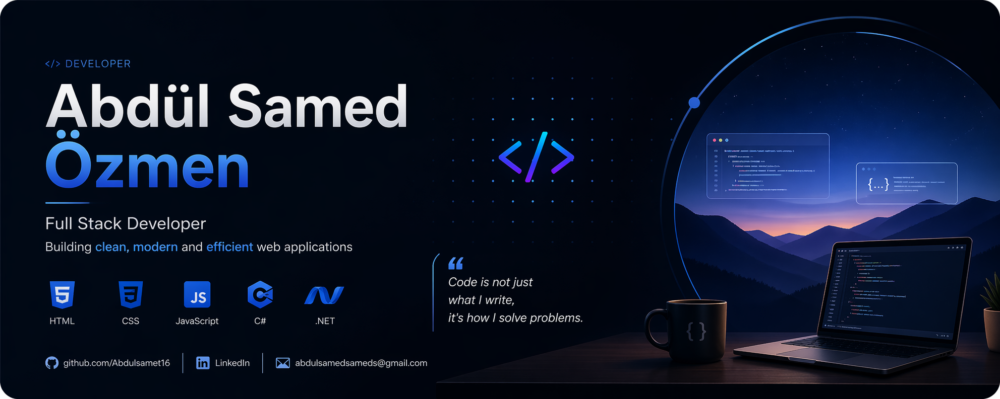

# 👋 Hi, I'm Abdulsamet

  

💻 Computer Engineering Student  
🌍 Interested in Web Development & Backend  
🚀 Currently learning ASP.NET Core & JavaScript  

---

## 🧠 About Me

- 🔭 I’m currently working on web projects
- 🌱 I’m learning full-stack development
- 🎯 Goal: Internship in Germany 🇩🇪
- 💡 Focused on building real-world projects

---
## 📊 GitHub Stats

  

---
## 🔥 Activity Graph

  

---

## 💻 Most Used Languages

  

## 🛠️ Tech Stack

- HTML / CSS / JavaScript
- ASP.NET Core MVC
- Git & GitHub
- Basic API usage

---

## 🚀 Projects

### 🌦️ Weather Outfit App
A weather app that gives outfit suggestions based on real-time data.

🔗 https://outfit-weather-app.netlify.app/

---

## 📈 Goals

- Build 5+ strong portfolio projects
- Learn React / Node.js
- Get internship abroad

---

## 📫 Contact

- GitHub: https://github.com/Abdulsamet16
